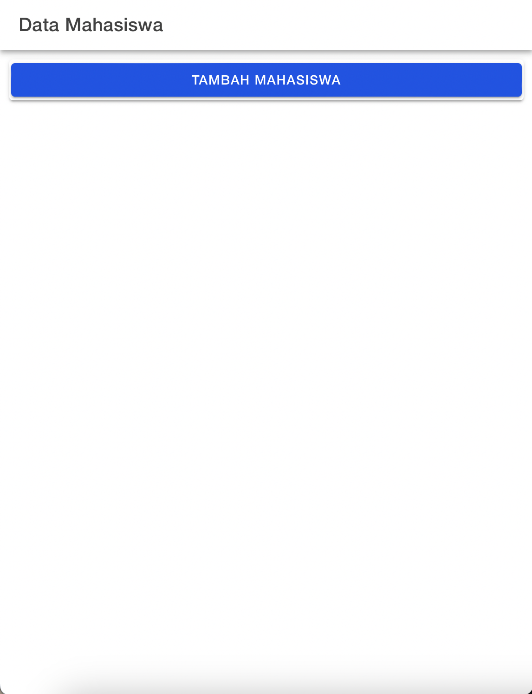
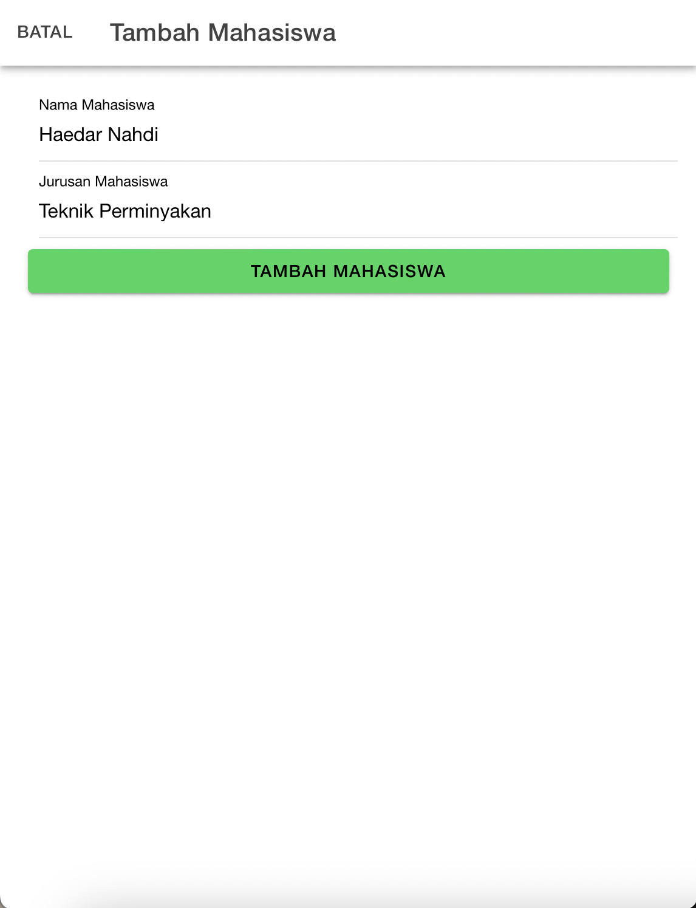
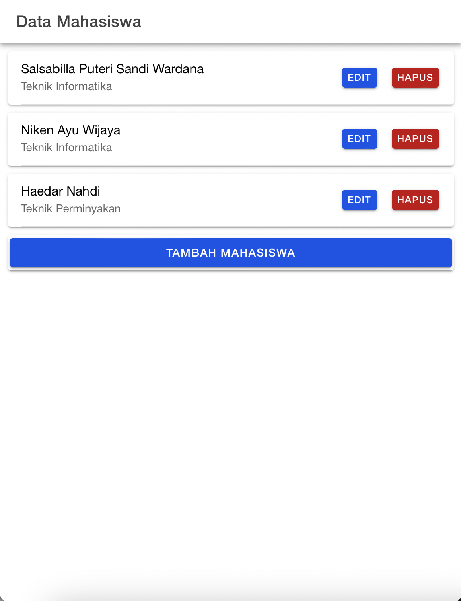

# Tugas Pertemuan 9

## 1. Halaman Home
Halaman home menampilkan button tambah mahasiswa yang akan mengarahkan ke halaman tambah mahasiswa

## 2. Halaman Tambah Mahasiswa
Halaman mahasiswa menampilkan form untuk menginputkan nama dan jurusan. tombol tambah mahasiswa digunakan untuk menambahkan data agar bisa terkirim dan disimpan di database

## 3. Halaman Tampil Mahasiswa
Halaman tampil mahasiswa menampilkan data yang sudah tersimpan di database

## 4. Halaman Edit Mahasiswa
Ketika melakukan klik di button edit pada halaman tampil mahasiswa, maka akan ditampilkan form berikut yang bisa digunakan untuk mengedit data. Nama dan jurusan bisa dilakukan perubahan. Button Edit mahasiswa ketika diklik akan menyimpan data didatabase dan menyimpan sesuai dengan perubahan yang dilakukan

Berikut adalah tampilan setelah dilakukan perubahan/edit jurusan pada data mahasiswa "Haedar Nahdi"

## 5. Halaman Hapus Mahasiswa
Manambahkan data mahasiswa sebagai percobaan untuk dihapus

Tampil data mahasiswa baru yang telah ditambahkan

Ketika dilakukan klik pada button hapus, maka akan muncul alert sebagai pesan konfirmasi sebelumnya dilakukan  penghapusan data

Berikut adalah tampilan dari hasil penghapusan mahasiswa "Nikeisha Hanum Wijaya"

